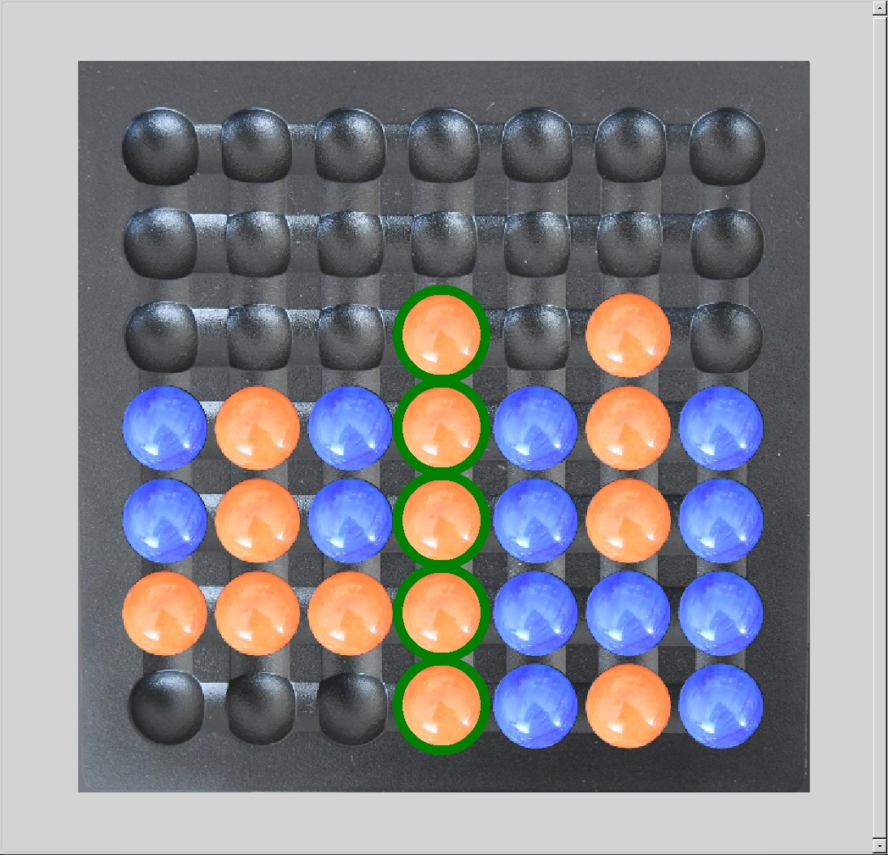

# Shiftago-Qt

Shiftago-Qt is a Qt-based implementation of the Shiftago board game. The game involves strategic placement and shifting of marbles to form winning lines.

The board looks like this: 

## Features

- Play against sophisticated AI with different skill levels (Rookie, Advanced, Expert, Grandmaster)
- Screenshot function
- Log file

## Getting Started

### Prerequisites

- Python 3.12 or higher
- Poetry with PyInstaller plugin

### Installation

1. Clone the repository:
    ```
    git clone https://gitlab.com/Genius_magnus/shiftago-qt.git
    cd shiftago-qt
    ```

2. Install the required dependencies using Poetry:
    ```
    poetry install
    ```

### Running the Game

To start the game, run the following command:
    
  ```
  poetry run python -m shiftago __main__.py
  ```
    
### Building a Distribution

To build a distribution, run the following command:
  ```
  poetry build
  ```

This will create a standalone executable in the `dist/pyinstaller/<arc>` directory.

## Usage

- Currently only the "express" variant of the Shiftago game is available
(https://www.wiwa-spiele.com/shiftago/en/rules_express.htm).

- It is not yet possible to select a colour interactively, but you
  can configure your preferred column in [shiftago-qt.cfg](shiftago-qt.cfg). There you can also
  configure the skill level.
- Directly after having launched the game the starting player is drawn by lot.
- Use the mouse to insert a marble at one of the four sides of the board. If the slot where you
  want to insert it is occupied the occupying marble and its neighbours are automatically shifted.

## Contributing

Contributions are welcome! Please follow these steps to contribute:

1. Fork the repository.
2. Create a new branch (`git checkout -b feature-branch`).
3. Make your changes and commit them (`git commit -m 'Add new feature'`).
4. Push to the branch (`git push origin feature-branch`).
5. Create a new Pull Request.

## License

This project is licensed under the GNU General Public License. See the [LICENSE.txt](LICENSE.txt) file for details.

## Contact

For any questions or feedback, please contact [genius.magnus@tuta.com](mailto:genius.magnus@tuta.com).
